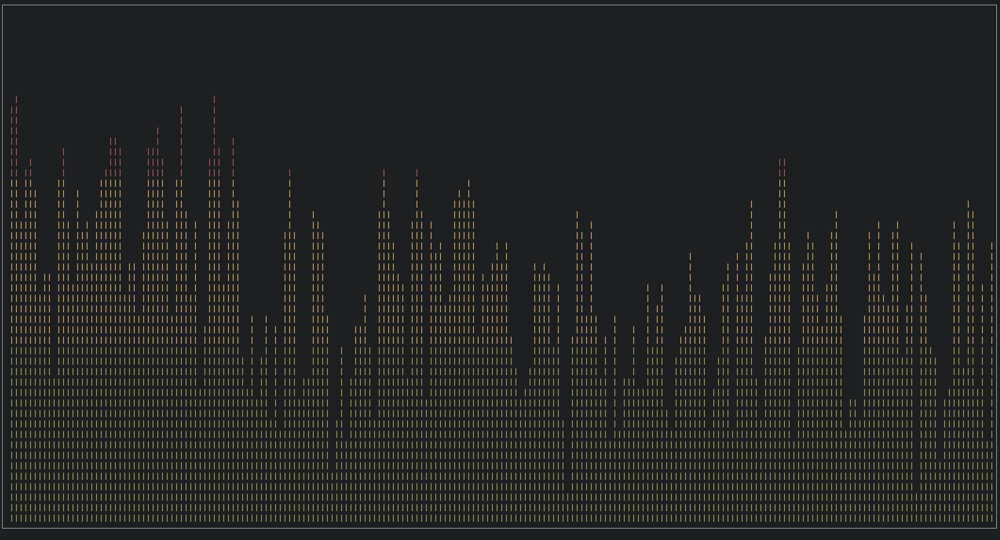

# PwatSpectrum

PwatSpectrum is a simple terminal audio visualizer powered by ncurses, PulseAudio, FFTW and caffeine. Written in C, it is inspired by the 2000s club nights. It is very performant, looks hot, and probably does not leak memory.

- `ui` folder:
Contains all the setup for the ncurses library, including window initialization and color setup.

- `sound` folder:
Initializes and sets up the audio input and read.

- `processing` folder:
Needed for the fftw setup, as well as for the Hann window.

- `main.c` file:
Binds those three libraries together so that the spectrogram can be displayed to the terminal.

---



## Usage Instructions:

- Compile with `make` 

- Start the program on your terminal with `./launcher.sh`. It is a wrapper script that detects if you're using either `pacmd` or `pactl` for your audio device.

You can run `make clean` if you run into issues and need to recompile.

You will need to install those libraries if they are missing:

```sh
sudo apt-get install libncurses-dev libpulse-dev
```

The FFTW library present in the apt package manager is outdated, so you would have to find and  build `fftw-3.3.10.tar.gz` or later.

As someone who was very much into music and sound engineering before moving to programming, this kind of project was bound to happen. There will be more audio related projects to come.
